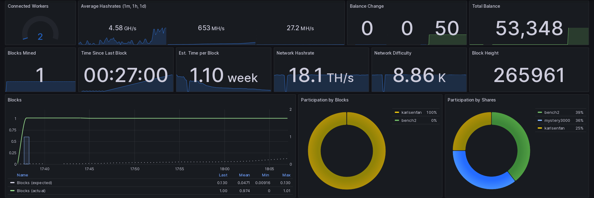

# Karlsen Stratum Adapter

This is a lightweight daemon that allows mining to a local (or remote)
karlsen node using stratum-base miners.

This daemon is confirmed working with the miners below in both dual-mining
and karlsen-only modes (for those that support it) and Windows, Linux,
macOS and HiveOS.

* [srbminer](https://github.com/doktor83/SRBMiner-Multi/releases)

No fee, forever.

Discord discussions/issues: [here](https://discord.gg/pPNESjGfb5)

Huge shoutout to https://github.com/KaffinPX/KStratum and
https://github.com/onemorebsmith/karlsen-stratum-bridge for the
inspiration.

Tips appreciated: `karlsen:qqe3p64wpjf5y27kxppxrgks298ge6lhu6ws7ndx4tswzj7c84qkjlrspcuxw`

## Hive Setup

[detailed instructions here](docs/hive-setup.md)

# Features

Shares-based work allocation with miner-like periodic stat output:

```
===============================================================================
  worker name   |  avg hashrate  |   acc/stl/inv  |    blocks    |    uptime
-------------------------------------------------------------------------------
 lemois         |       0.13GH/s |          3/0/0 |            0 |       6m48s
-------------------------------------------------------------------------------
                |       0.13GH/s |          3/0/0 |            0 |       7m20s
========================================================= kls_bridge_v1.0.0 ===
```

## Grafana UI

The grafana monitoring UI is an optional component but included for
convenience. It will help to visualize collected statistics.

[detailed instructions here](docs/monitoring-setup.md)




## Prometheus API

If the app is run with the `-prom={port}` flag the application will host
stats on the port specified by `{port}`, these stats are documented in
the file [prom.go](src/karlsenstratum/prom.go). This is intended to be use
by prometheus but the stats can be fetched and used independently if
desired. `curl http://localhost:2114/metrics | grep kls_` will get a
listing of current stats. All published stats have a `kls_` prefix for
ease of use.

```
user:~$ curl http://localhost:2114/metrics | grep kls_
# HELP kls_estimated_network_hashrate_gauge Gauge representing the estimated network hashrate
# TYPE kls_estimated_network_hashrate_gauge gauge
kls_estimated_network_hashrate_gauge 2.43428982879776e+14
# HELP kls_network_block_count Gauge representing the network block count
# TYPE kls_network_block_count gauge
kls_network_block_count 271966
# HELP kls_network_difficulty_gauge Gauge representing the network difficulty
# TYPE kls_network_difficulty_gauge gauge
kls_network_difficulty_gauge 1.2526479386202519e+14
# HELP kls_valid_share_counter Number of shares found by worker over time
# TYPE kls_valid_share_counter counter
kls_valid_share_counter{ip="192.168.0.17",miner="SRBMiner-MULTI/2.4.1",wallet="karlsen:qzk3uh2twkhu0fmuq50mdy3r2yzuwqvstq745hxs7tet25hfd4egcafcdmpdl",worker="002"} 276
kls_valid_share_counter{ip="192.168.0.24",miner="SRBMiner-MULTI/2.4.1",wallet="karlsen:qzk3uh2twkhu0fmuq50mdy3r2yzuwqvstq745hxs7tet25hfd4egcafcdmpdl",worker="003"} 43
kls_valid_share_counter{ip="192.168.0.65",miner="SRBMiner-MULTI/2.4.1",wallet="karlsen:qzk3uh2twkhu0fmuq50mdy3r2yzuwqvstq745hxs7tet25hfd4egcafcdmpdl",worker="001"} 307
# HELP kls_worker_job_counter Number of jobs sent to the miner by worker over time
# TYPE kls_worker_job_counter counter
kls_worker_job_counter{ip="192.168.0.17",miner="SRBMiner-MULTI/2.4.1",wallet="karlsen:qzk3uh2twkhu0fmuq50mdy3r2yzuwqvstq745hxs7tet25hfd4egcafcdmpdl",worker="002"} 3471
kls_worker_job_counter{ip="192.168.0.24",miner="SRBMiner-MULTI/2.4.1",wallet="karlsen:qzk3uh2twkhu0fmuq50mdy3r2yzuwqvstq745hxs7tet25hfd4egcafcdmpdl",worker="003"} 3399
kls_worker_job_counter{ip="192.168.0.65",miner="SRBMiner-MULTI/2.4.1",wallet="karlsen:qzk3uh2twkhu0fmuq50mdy3r2yzuwqvstq745hxs7tet25hfd4egcafcdmpdl",worker="001"} 3425
```

# Install

## Docker (all-in-one)

Note: This requires that docker is installed.

`docker compose -f docker-compose-all.yml up -d` will run the bridge with
default settings. This assumes a local karlsend node with default port
settings and exposes port 5555 to incoming stratum connections. It will
pull-down a pre-built-image.

`docker compose -f docker-compose-all-src.yml up -d` will build the
bridge component from source and guarantee to be up to date. Use
`docker compose -f docker-compose-all-src.yml up -d --build kls_bridge`
to ensure the bridge component is rebuilt after pulling down updates
from GitHub.

In both cases, it also spins up a local prometheus and grafana instance
that gather stats and host the metrics dashboard. Once the services are
up and running you can view the dashboard using `http://127.0.0.1:3000/d/x7cE7G74k/klsb-monitoring`

Default grafana user: `admin`

Default grafana pass: `admin`

Many of the stats on the graph are averaged over a configurable time
period (24hr default - use the 'resolution' dropdown to change this), so
keep in mind that the metrics might be incomplete during this initial
period.

## Docker (non-compose)

Note: This does not require pulling down the repo, it only requires that
docker is installed. However, as this relies on a prebuilt image from a
repository, it may not always be up to date with the latest source.

`docker run -p 5555:5555 karlsennetwork/karlsen_bridge:latest --log=false`

This will run the bridge with default settings. This assumes a local
karlsend node with default port settings and exposes port 5555 to incoming
stratum connections.

Advanced and customized configuration.

`docker run -p {stratum_port}:5555 karlsennetwork/karlsen_bridge --log=false --karlsen={karlsend_address} --stats={false}`

This will run the bridge targeting a karlsend node at {karlsend_address}.
Stratum port accepting connections on {stratum_port}, and only logging
connection activity, found blocks, and errors.

## Build from source (native executable)

Install go 1.18 using whatever package manager is appropriate for your
system.

```
cd cmd/karlsenbridge
go build .
```

Modify the config file in `./cmd/karlsenbridge/config.yaml` with your setup,
the file comments explain the various flags.

```
./karlsenbridge
```

To recap the entire process of initiating the compilation and launching
the karlsen dridge, follow these steps:

```
cd cmd/karlsenbridge
go build .
./karlsenbridge
```
